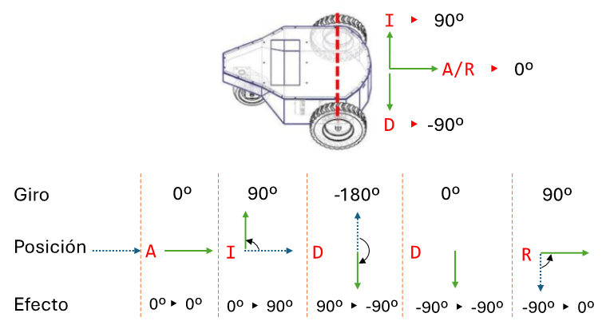

# Primer parcial

## p1e1.figura.py (2.5 puntos) 
*Realizar un programa que a partir de la altura (leída de teclado) dibuje la siguiente figura:*
```
Altura: 7
X....X
XX...XX
XXX..XXX
XXXX.XXXX
XXX..XXX
XX...XX
X....X
```

```python
altura: int = int(input("Altura: "))

num_lineas: int = altura//2 + 1
num_Xs: int = 1
num_puntos: int = altura//2 + 1
for linea in range(num_lineas):
    for x in range(num_Xs):
        print("X", end="")
    for p in range(num_puntos):
        print(".", end="")
    for x in range(num_Xs):
        print("X", end="")
    print()
    num_Xs += 1
    num_puntos -= 1

num_lineas: int = altura//2
num_Xs: int = altura//2
num_puntos: int = 2
for linea in range(num_lineas):
    for x in range(num_Xs):
        print("X", end="")
    for p in range(num_puntos):
        print(".", end="")
    for x in range(num_Xs):
        print("X", end="")
    print()
    num_Xs -= 1
    num_puntos += 1
```

## p1e2.actas.py (2.5 puntos) 
*La cantidad de Matrículas de Honor (máxima calificación) está limitada según el número de alumnos del grupo. En el grupo actual se pueden poner 2 Matrículas de Honor como máximo. Haga un programa que lea como mucho las notas de los 49 alumnos y nos diga si se puede poner Matrícula de Honor a todos los que tienen un 10. Se valorará la eficiencia de la solución. Por ejemplo, si voy leyendo las siguientes notas 10 7 8 9 10 4 10, ya podría parar ya que al haber leído 3 notas a 10 sé que sobrepaso el máximo y que todos no podrán recibir Matrícula de honor.*

```python
MAX_ALUM: int = 49
MAX_MH: int = 2

contador_mh: int = 0
contador_notas:int = 0
while contador_notas < MAX_ALUM and contador_mh <= MAX_MH:
    nota: int = int(input("Nota: "))
    if nota == 10:
        contador_mh += 1
    contador_notas += 1

if contador_mh > MAX_MH:
    print("Hay más MH que las que puede poner")
else:
    print("No hay más MH que las que puede poner")
```

## p1e3.robot.py (2.5 puntos) 
*Queremos controlar el motor de un robot para que siga una ruta predefinida. Para ello, el usuario introducirá una cadena de caracteres usando 4 posibles letras: I para girar a la izquierda, D para girar a la derecha, A para avanzar recto, R para retroceder recto. Para ello el programa deberá traducir estas órdenes a órdenes de giro en grados del eje de dirección. En caso de encontrar una orden incorrecta, indicarlo y no girar el eje de dirección. Por ejemplo, la secuencia AIDDR generaría 0 grados (para la Avanzar), luego 90 (para ir a la Izquierda), luego -180 (para pasar de 90 a -90 y poder ir a la Derecha), 0 grados (como ya estamos mirando a la Derecha no hace falta girar) y finalmente 90 (para pasar de -90 a 0 y poder Retroceder recto). Ese mismo ejemplo, visualmente se puede ver en la siguiente imagen:*


 
*Un ejemplo sería:*
```
Introduzca ordenes: AIRDTIAIDR
Girar 0 grados
Girar 90 grados
Girar -90 grados
Girar -90 grados
Orden incorrecta, no se actúa sobre el eje de dirección. Girar 0 grados
Girar 180 grados
Girar -90 grados
Girar 90 grados
Girar -180 grados
Girar 90 grados
```

```python
ordenes: str = input("Introduzca ordenes: ")

angulo_actual: int = 0
for orden in ordenes:
    if orden == "A":
        angulo_nuevo = 0
    elif orden == "R":
        angulo_nuevo = 0
    elif orden == "D":
        angulo_nuevo = -90
    elif orden == "I":
        angulo_nuevo = 90
    else:
        angulo_nuevo = angulo_actual
        print("Orden incorrecta, no se actúa sobre el eje de dirección.", end=" ")
    print("Girar", angulo_nuevo - angulo_actual, "grados")
    angulo_actual = angulo_nuevo
```

## p1e4.oxigeno.py (2.5 puntos) 
*Queremos realizar un software para monitorizar los niveles de oxígeno en sangre. El programa aceptará lecturas de oxígeno (porcentaje de SpO2) hasta que se ingrese un valor peligroso, es decir, un nivel inferior al 85% o superior al 100%. Al finalizar, el programa deberá: mostrar el nivel mínimo de oxígeno en sangre registrado antes de la lectura peligrosa, el promedio de oxígeno hasta leer el nivel de oxígeno peligroso e indicar cuántas veces subió y bajó respecto a la medición previa. Un posible ejemplo es:*

```
Ingrese el nivel de oxígeno en sangre (% SpO2): 96
Ingrese el nivel de oxígeno en sangre (% SpO2): 94
Ingrese el nivel de oxígeno en sangre (% SpO2): 97
Ingrese el nivel de oxígeno en sangre (% SpO2): 92
Ingrese el nivel de oxígeno en sangre (% SpO2): 101
Nivel mínimo de oxígeno registrado: 92% SpO2
Promedio de oxígeno hasta la lectura peligrosa: 94.75% SpO2
El nivel de oxígeno subió 1 veces y bajó 2 veces
```

```python
nivel: int = int(input("Ingrese el nivel de oxígeno en sangre (% SpO2): "))
anterior: int = nivel
minimo: int = nivel
suma: int = 0
contador: int = 0
sube: int = 0
baja: int = 0
while nivel >= 85 and nivel <= 100:
    if nivel < minimo:
        minimo = nivel
    
    if nivel > anterior:
        sube += 1
    elif nivel < anterior:
        baja += 1
    
    suma += nivel
    contador += 1
    nivel: int = int(input("Ingrese el nivel de oxígeno en sangre (% SpO2): "))

if contador == 0:
    print("No se leyó nada correcto")
else:
    print("Nivel mínimo de oxígeno registrado: ", minimo, "% SpO2", sep="")
    print("Promedio de oxígeno hasta la lectura peligrosa: ", suma/contador, "% SpO2", sep="")
    print("El nivel de oxígeno subió", sube, "veces y bajó", baja, "veces")
```

